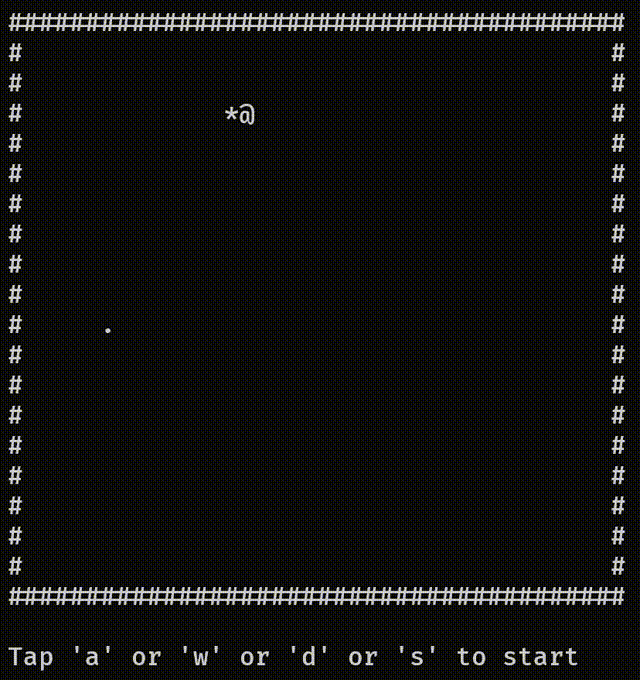

# GreedySnake
GreedySnake within 100 lines in C++, featuring a custom doubly linked list.  

  

# Introduction  
Implement the Snake game using a linked list. When the snake moves, a new head node is added while a tail node is deleted. When the snake eats food, only the head node is updated at the food position.  
more details in code comments.   
Some techniques used:  
1. kbhit(): A non-STL function to read keyboard input, relying on the header file #include <conio.h>.  

2. Control the screen using escape sequences:  
Print a character at a specific position:  
cout << "\033[" << y << ";" << x << "H" << c;  
Clear screen:  
cout << "\x1b[2J";  
Hide the console cursor:  
cout << "\e[?25l";  

# History  
version 1.0:  
Implemented using classes and a singly linked list.  
--20231225  
version 2.0:  
By removing classes and using a doubly linked list, redundant functionality and code were eliminated, and the time complexity for movement and condition checks was optimized from O(n) to O(1).      
--20240706  
version 3.0:    
Further optimize the code.      
--20250117  

